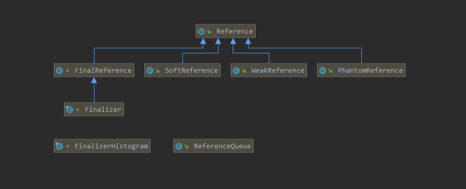
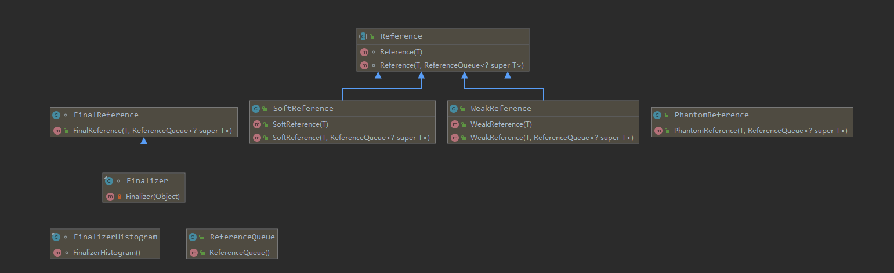

<!-- TOC -->

- [Java 4种应用类型](#java-4%e7%a7%8d%e5%ba%94%e7%94%a8%e7%b1%bb%e5%9e%8b)
  - [FinalReference(强引用)](#finalreference%e5%bc%ba%e5%bc%95%e7%94%a8)
  - [SoftReference(软引用)](#softreference%e8%bd%af%e5%bc%95%e7%94%a8)
  - [WeakReference(弱引用)](#weakreference%e5%bc%b1%e5%bc%95%e7%94%a8)
  - [PhantomReference(虚引用)](#phantomreference%e8%99%9a%e5%bc%95%e7%94%a8)
  - [ReferenceQueue(应用队列)](#referencequeue%e5%ba%94%e7%94%a8%e9%98%9f%e5%88%97)
- [各种引用类型总结](#%e5%90%84%e7%a7%8d%e5%bc%95%e7%94%a8%e7%b1%bb%e5%9e%8b%e6%80%bb%e7%bb%93)
  - [虚引用触发OOM](#%e8%99%9a%e5%bc%95%e7%94%a8%e8%a7%a6%e5%8f%91oom)
- [使用场景](#%e4%bd%bf%e7%94%a8%e5%9c%ba%e6%99%af)
  - [SoftHashMap](#softhashmap)
  - [WeakHashMap](#weakhashmap)

<!-- /TOC -->

# Java 4种应用类型
java提供``FinalReference(强引用)`` ``SoftReference(软引用)`` ``WeakReference(弱引用)`` ``PhantomReference(虚引用)``4中应用类型, 这3个引用类型都继承了java.lang.ref.Reference&lt;T&gt;类




## FinalReference(强引用)
```Java
    Object object = new Object();
```
- 强引用可以直接访问目标对象。
- 强引用所指向的对象在任何时候都不会被系统回收。
- 强引用可能导致内存泄漏。


## SoftReference(软引用)
```Java
    SoftReference<Object> objectSoftReference = new SoftReference<Object>(new Object());
```
- 软引用使用 get() 方法取得对象的强引用从而访问目标对象。
- 软引用所指向的对象按照 JVM 的使用情况（Heap 内存是否临近阈值）来决定是否回收。
- 软引用可以避免 Heap 内存不足所导致的异常。

```Java
    public static void main(String[] args) {
        SoftReference<Object> object = new SoftReference<Object>(new Object());
        List<byte[]> list = new LinkedList<byte[]>();
        while (object.get() != null) {
            System.out.println(object.get());
            list.add(new byte[1024 * 1024 * 1]);  // 有可能触发OOM多试几次就可以了
        }
        System.out.println(object.get());
    }
```


## WeakReference(弱引用)
```Java
    WeakReference<Object> objectWeakReference = new WeakReference<Object>(new Object());
```
- 弱引用使用 get() 方法取得对象的强引用从而访问目标对象。
- 一旦系统内存回收，无论内存是否紧张，弱引用指向的对象都会被回收。
- 弱引用也可以避免 Heap 内存不足所导致的异常。

 ```Java
    public static void main(String[] args) {
        WeakReference<Object> object = new WeakReference<Object>(new Object());
        System.out.println(object.get());
        System.gc(); // 唤起GC去回收 虽然不能100%唤起
        System.out.println(object.get());
    }
 ```   


## PhantomReference(虚引用)
```Java
    PhantomReference<Object> objectPhantomReference = new PhantomReference<Object>(new Object());
```
- 虚引用永远无法使用 get() 方法取得对象的强引用从而访问目标对象。
- 虚引用所指向的对象在被系统内存回收前，虚引用自身会被放入 ReferenceQueue 对象中从而跟踪对象垃圾回收。
- 虚引用不会根据内存情况自动回收目标对象。


```Java
    public static void main(String[] args) {
        PhantomReference<Object> object = new PhantomReference<Object>(new Object(), new ReferenceQueue<Object>());
        System.out.println(object.get());
    }
```

## ReferenceQueue(应用队列)
```Java
    public static void main(String[] args) {
        ReferenceQueue<Object> referenceQueue = new ReferenceQueue<Object>();
        PhantomReference<Object> objectPhantomReference = new PhantomReference<Object>(new Object(), referenceQueue);
        System.gc();
        System.runFinalization();
        System.out.println(referenceQueue.poll() == objectPhantomReference);
    }
```
# 各种引用类型总结

| 应用类型                 | 回收条件                    | OOM |
| ------------------------ | --------------------------- | --- |
| FinalReference(强引用)   | 对象未引用(具体参考JVM实现) | Y   |
| SoftReference(软引用)    | 内存不足时                  | N   |
| WeakReference(弱引用)    | 由GC回收                    | N   |
| PhantomReference(虚引用) | 不回收                      | Y   |

> 卧槽, 为啥``PhantomReference(虚引用)``能触发OOM, 其实这是和引用类型的构造方法有关

| 引用类型                 | 构造方法                                                                                          |
| ------------------------ | ------------------------------------------------------------------------------------------------- |
|                          |                                                                                                   |
| SoftReference(软引用)    | public SoftReference(T referent)<br>public SoftReference(T referent, ReferenceQueue<? super T> q) |
| WeakReference(弱引用)    | public WeakReference(T referent)<br>public WeakReference(T referent, ReferenceQueue<? super T> q) |
| PhantomReference(虚引用) | public PhantomReference(T referent, ReferenceQueue<? super T> q)                                  |




## 虚引用触发OOM
```Java
    public static void main(String[] args) {
        ReferenceQueue<byte[]> queue = new ReferenceQueue<byte[]>();
        while (true) {
            PhantomReference<byte[]> bytes = new PhantomReference<byte[]>(new byte[1024 * 1024 * 10], queue);
            System.gc();
            System.runFinalization();
            // queue.poll(); // 不调用queue.poll()方法会触发OOM
        }
    }
```
```
api文档的说明
Phantom reference objects, which are enqueued after the collector determines that their referents may otherwise be reclaimed. Phantom references are most often used for scheduling pre-mortem cleanup actions in a more flexible way than is possible with the Java finalization mechanism.
If the garbage collector determines at a certain point in time that the referent of a phantom reference is phantom reachable, then at that time or at some later time it will enqueue the reference.

In order to ensure that a reclaimable object remains so, the referent of a phantom reference may not be retrieved: The get method of a phantom reference always returns null.

Unlike soft and weak references, phantom references are not automatically cleared by the garbage collector as they are enqueued. An object that is reachable via phantom references will remain so until all such references are cleared or themselves become unreachable.
```


# 使用场景

## SoftHashMap
``SoftHashMap``实现了继承``AbstractMap``类, 实现对数据的缓存
```XML
    <dependency>
        <groupId>org.aspectj</groupId>
        <artifactId>aspectjweaver</artifactId>
        <version>${version}</version>
    </dependency>
```

```Java
package org.aspectj.util;

import java.lang.ref.ReferenceQueue;
import java.lang.ref.SoftReference;
import java.util.AbstractMap;
import java.util.Collections;
import java.util.HashMap;
import java.util.Map;

public class SoftHashMap<K, V> extends AbstractMap<K, V> {
    private Map<K, SpecialValue> map;
    private ReferenceQueue<? super V> rq = new ReferenceQueue();

    public SoftHashMap() {
        this.map = new HashMap<K, SpecialValue>();
    }

    class SpecialValue extends SoftReference<V> {
        private final K key;

        SpecialValue(K k, V v) {
            super(v, rq);
            this.key = k;
        }
    }

    private void processQueue() {
        SpecialValue sv = null;
        while ((sv = (SpecialValue) rq.poll()) != null) {
            map.remove(sv.key);
        }
    }

    @Override
    public V get(Object key) {
        SpecialValue ref = map.get(key);
        if (ref == null) {
            map.remove(key);
            return null;
        }
        V value = ref.get();
        if (value == null) {
            map.remove(ref.key);
            return null;
        }
        return value;
    }

    @Override
    public V put(K k, V v) {
        processQueue();
        SpecialValue sv = new SpecialValue(k, v);
        SpecialValue result = map.put(k, sv);
        return (result == null ? null : result.get());
    }

    @Override
    public java.util.Set<Map.Entry<K, V>> entrySet() {
        if (map.isEmpty()) {
            return Collections.<K, V>emptyMap().entrySet();
        }
        Map<K, V> currentContents = new HashMap<K, V>();
        for (Map.Entry<K, SpecialValue> entry : map.entrySet()) {
            V currentValueForEntry = entry.getValue().get();
            if (currentValueForEntry != null) {
                currentContents.put(entry.getKey(), currentValueForEntry);
            }
        }
        return currentContents.entrySet();
    }

    @Override
    public void clear() {
        processQueue();
        map.clear();
    }

    @Override
    public int size() {
        processQueue();
        return map.size();
    }

    @Override
    public V remove(Object k) {
        processQueue();
        SpecialValue ref = map.remove(k);
        if (ref == null) {
            return null;
        }
        return ref.get();
    }
}
```
## WeakHashMap
``WeakHashMap``是JDk自带的一个类, 继承``AbstractMap``实现``Map``，这里就不在贴出代码了