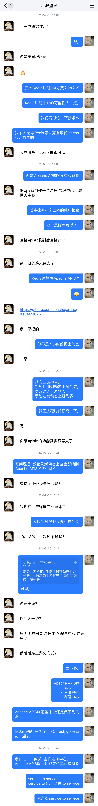
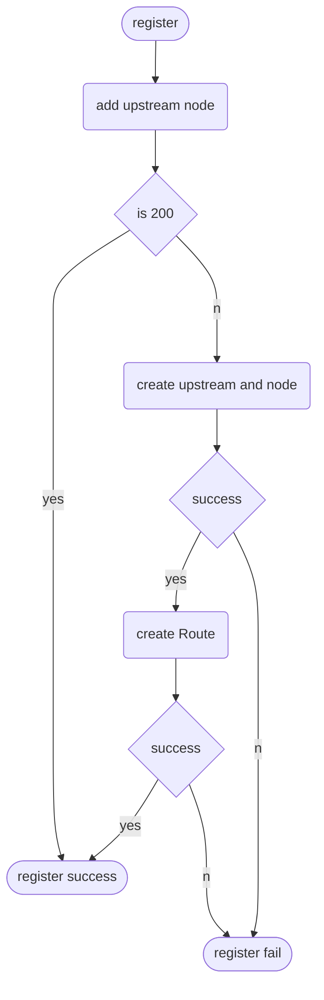

<!-- TOC -->

- [Apache APISIX初体验](#apache-apisix初体验)
- [Spring Cloud APISIX的由来](#spring-cloud-apisix的由来)
- [Spring Cloud APISIX介绍](#spring-cloud-apisix介绍)
- [后言](#后言)

<!-- /TOC -->


# Apache APISIX初体验

Java因为众所周知的IO性能问题导致其高并发环境下极其的拉垮，虽然有基于Netty NIO而孵化的二代网关Spring Cloud Gateway性能得到了前所未有的提升，但基于Java的网关性能大多都只到达了基于C语言性能的一半，迫切的寻求一个高性能网关代替Spring Cloud Gateway但是Nginx无法完美融入Spring Cloud生态，针对Nginx深度定制一个discovery module对难度对于一个Java boy来说是地狱级别吧。


为了离开Java的世界兜兜转转就接触到了Apache APISIX，第一次接触到了Apache APISIX的时候就瞬间爱上了Apache APISIX。正如Apache APISIX的官方所描述它兼具动态、实时、高性能等特点，提供了负载均衡、动态上游、灰度发布（金丝雀发布）、服务熔断、身份认证、可观测性等丰富的流量管理功能。


前期为了将Apache APISIX融入Spring Cloud中我们采用discovery插件将注册中心同步到Apache APISIX中, 同步注册中心也是大部分团队所采用的方式。

```Mermaid
flowchart BT

    client --3.request--> ApacheAPISIX --4.request--> services
    services --1.register--> discovery
    discovery --2.sync--> ApacheAPISIX
    subgraph services
     direction TB
     Instance1
     Instance2
     Instance3
    end
```

# Spring Cloud APISIX的由来

孵化Spring Cloud APISIX的起因源于22年国庆前一天的带薪聊天。



如此新颖的想法在Spring Cloud生态并不是主流，为能让想法成功落地国庆期间在家中闷头编写Spring Cloud APISIX，利用7天的假期成功的完成了Spring Cloud APISIX的注册中心、服务发现、负载均衡三个核心功能后续经过3周的测试运行成功的在11月份正式开源了Spring Cloud APISIX源代码。

Spring Cloud APISIX的设计是让Apache APISIX即是注册中心又是网关，通过Apache APISIX核心的3个核心/组件（Route、Upstream、Admin API）搭配而实现。

| 概念/组件 | Spring Cloud模块 |
| --------- | ---------------- |
| Route     | 网关             |
| Upstream  | 注册中心         |
| Admin API | core api         |





# Spring Cloud APISIX介绍
依托于Spring Cloud Commons对微服务中的服务注册、服务发现、负载均衡等功能的抽象层Spring Cloud APISIX能够迅速的开发完成，以Spring Cloud APISIX为基础可以很容易进行微服务开发。

目前Spring Cloud APISIX提供如下功能
- 服务注册与发现：适配 Spring Cloud 服务注册与发现标准
- 路由注册：结合服务注册自动向Apache APISIX注册路由
- 负载均衡：扩展Spring Cloud LoadBalancer以支持统一网关流量
- 开发工具：用于解决Apache APISIX API 在开发环境中的缺陷


看完上述功能是不是觉得特性太少了，Spring Cloud APISIX并不是分布式一站式解决方案而是对Apache APISIX生态在Java方向的扩展补充。

Spring Cloud APISIX在未来的规划中我们不会过多对Spring Cloud进行扩展而是选择利用Apache APISIX插件来更替Spring Cloud的模块，


| 组件           | 概念/组件              |
| -------------- | ---------------------- |
| 服务中心       | Upstream               |
| api网关        | Route                  |
| 负载均衡       | 网关统一东西流量       |
| 服务容错       | Traffic相关插件        |
| 链路追踪       | Tracers相关插件        |
| 身份认证       | Authentication相关插件 |
| 服务到服务调用 | -                      |
| 配置中心       | -                      |


关于S2S(Svice to Svice)和S2G2S(Svice to Gateway to Svice)的问题，目前因为[/healthcheck/upstreams/{id}](https://apisix.apache.org/docs/apisix/control-api/#get-v1upstreamupstream_id)的玄学（BUG）问题，导致S2S调用时偶尔会出现[issue#7964](https://github.com/apache/apisix/issues/7964) [issues#7141](https://github.com/apache/apisix/issues/7141)中所描述的场景，Spring Cloud APISIX目前推荐使用S2G2S进行RPC调用。

```Mermaid
flowchart 
    subgraph S2G2S
        subgraph ApacheAPISIXs
            ApacheAPISIX1(ApacheAPISIX inner)
            ApacheAPISIX2(ApacheAPISIX outer)
        end
        client1(client)
        consumer1(consumer)
        Provider1(Provider)
    end
    Provider1 --1.register--> ApacheAPISIXs
    client1 --3.request--> ApacheAPISIX2
    consumer1 --3.request--> ApacheAPISIX1
    ApacheAPISIX2 --4.request--> Provider1
    ApacheAPISIX1 --4.request--> Provider1
    
    subgraph S2S
        client2(client)
        ApacheAPISIX3(ApacheAPISIX)
        consumer2(consumer)
        Provider2(Provider)
    end

    client2 --3.request--> ApacheAPISIX3
    Provider2 --1.register--> ApacheAPISIX3
    consumer2 --2.subscribe--> ApacheAPISIX3
    consumer2 --3.request--> Provider2
    ApacheAPISIX3 --4.request--> Provider2

```


# 后言

> 1. 聊天的中的[apisix/issues#8026](https://github.com/apache/apisix/issues/8026)让我有点吃醋了，当时内心的真实想法就是“他为啥issue中只字不提我最喜欢的Spring Cloud，很生气，很无奈，那么我必须要做点什么让这个issue上出现Spring Cloud的字眼”。回想我在编写Spring Cloud APISIX时他每天打电话询问我进度如何现在想想我明白了，我被他钓鱼了。

> 2. 为何不在maven中央仓库发行，Spring Cloud APISIX获取健康的ServiceInstances是通过[/healthcheck/upstreams/{id}](https://apisix.apache.org/docs/apisix/control-api/#get-v1upstreamupstream_id)来实现的，该这个API十分的玄学（BUG）会出现 [issue#7964](https://github.com/apache/apisix/issues/7964) [issues#7141](https://github.com/apache/apisix/issues/7141)中所描述的场景，受限于该API的玄学导致我迟迟不敢正式对外发布。
