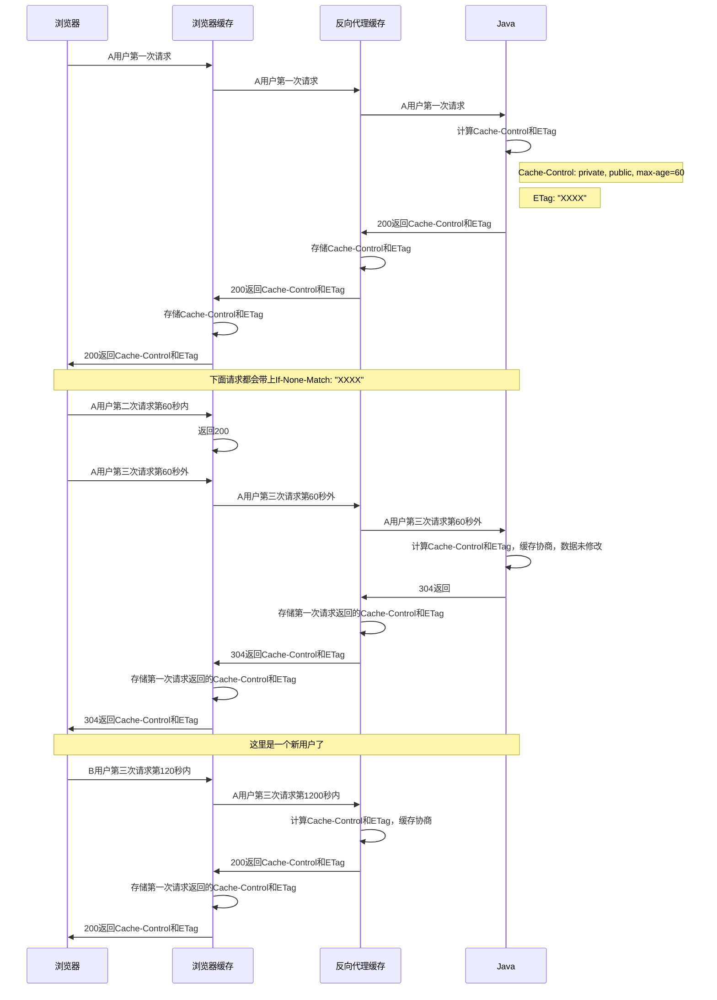
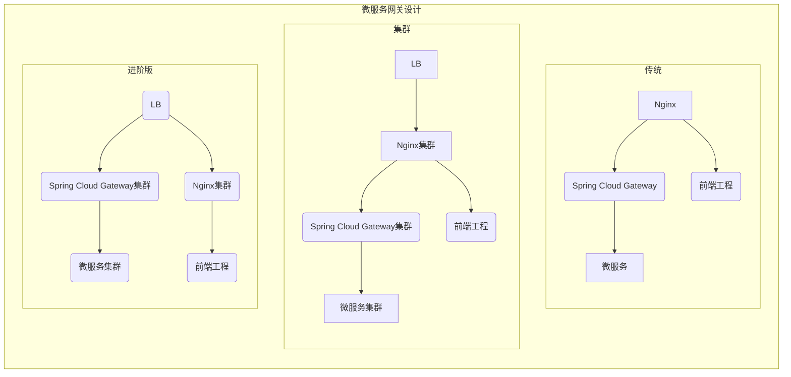
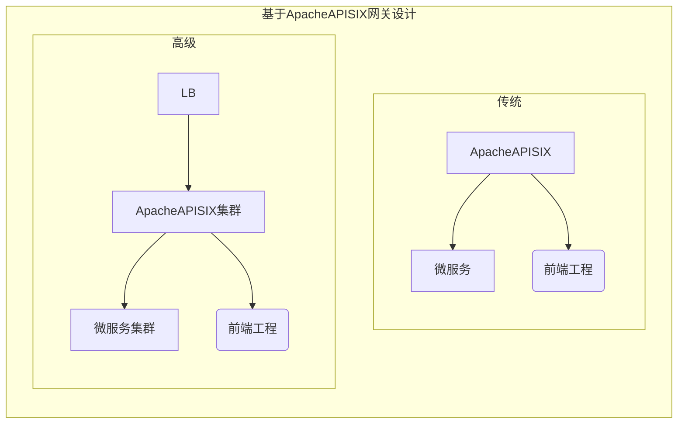
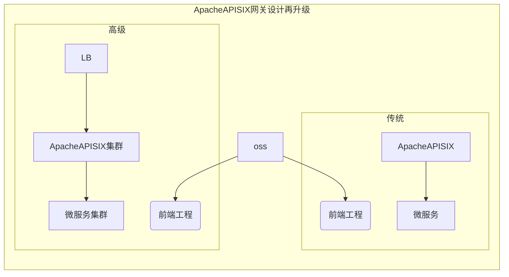

```txt
Copyright 2022 魏昌进(weichangjin1996@gmail.com)

Licensed under the Apache License, Version 2.0 (the "License");
you may not use this file except in compliance with the License.
You may obtain a copy of the License at

    http://www.apache.org/licenses/LICENSE-2.0

Unless required by applicable law or agreed to in writing, software
distributed under the License is distributed on an "AS IS" BASIS,
WITHOUT WARRANTIES OR CONDITIONS OF ANY KIND, either express or implied.
See the License for the specific language governing permissions and
limitations under the License.
```


```txt
@author changjin wei(魏昌进)
@since 2022/5/16 
```


# 1. 基于B/S架构的HTTP协议三级缓存设计

## 1.1. 骚话连篇

事出反常必有妖，我不作妖才怪呐，就是我最近离职了，因为呆在国企也就那样子吧（妈的，这个国企在我签约前被卖给了私企，操蛋了），垃圾领导要求我这个垃圾照着垃圾文档写垃圾代码，写出的项目被客户不满意呀，既然不让写出好代码我就索性离职吧，挣快钱真没有意思倒不如还各方一个清静，幸好就签约一年所以离职手续走的贼快（真爽）。

程序设计无非就是``时间问题``和``空间问题``，但是现在本质已经变了现在的软件工程师已经不在乎软件质量以及代码质量，以增加``系统复杂度``的来解决并发问题，软件变成变成了PPT编程。


其实大家都知道很多缓存方案 Redis读写缓存呀，MongoDB文档缓存呀，网页静态化呀，，其实玩来玩去也就那样子这么多年了也没有什么创新的点子出现。既然大家都知道缓存方案为啥我还要专门写一篇文章去解释这个缓存方案设计哪，主要原因就是因为我没有找到这个方案的轮子，我是真的没有轮子，Spring和其他Java社区都没有提供。

难道服务端就不能去控制缓存嘛？我在思考这个问题，服务端控制代理服务器和浏览器的缓存，并且做好缓存协商和缓存过期，利用好http缓存可以极大的减小服务端压力，无论是网络传输还是servlet容器对http的解析。


秉承着百度和Google都不能解决解决你的问题甚至没有答案，那么恭喜你了，你要自己去解决问题并且发布解决方案了，所以我要造轮子以及写博客了。

其实压根就没有打算写这篇文章，我甚至都打算结束我的编程生涯从此不玩编程，想着另寻出路了，但还是打算好好写这篇文章以作为我编程生涯的的终章。

## 1.2. 设计初衷

HTTP协议作为B/S架构最通用的协议，但是大家都没有很好的利用HTTP协议。（中国开发工程师就那点水平吧，纸上谈兵之士，我也是纸上谈兵，哈哈哈）

提升网站并发首先就是要缩短距离和减小体积以加快响应（我称之为“短小快”）

HTTP协议的缓存策略可以缩短网页请求资源的距离，减少延迟，节省网络流量，并且由于缓存文件可以重复利用，降低网络负荷，加快客户端响应。

其实一个高并发网站的流量95%都是``读流量``，``写流量``甚至都达不到5%，Java工程师引用Redis将大量数据放入Redis来解决``读流量``其实是错误甚至是致命的，在重后端轻前端的软件开发环境下大家都是优先从后端入手去解决``读流量``很少从网络传输协议入手去解决问题。运维工程师对于HTT议缓存也仅仅是Nginx对静态资源设置一个``Cache-Control: max-age=31536000``。

其实运维工程师也很难判断缓存什么时候过期，过期时间设置多大，毕竟谁知道后端工程师什么时候更新数据呐。（这里就没有前端什么事情了，浏览器都已经维护好HTTP缓存了）


## 1.3. 解决思路

哼，感觉Spring对HTTP协议支持太少了（有点郁闷），以至于我觉得他们是不是故意不开源部分代码用于商业支持。

以后端方式来控制HTTP缓存（当然不是后端返回数据加一个``Cache-Control: max-age=31536000``），后端来决定HTTP缓存的时间，其中涉及到 HTTP协议缓存失效机制、反向代理缓存、后端缓存控制。

HTTP协议大家很熟悉吧，废话少说写文章打字很累，直接上链接吧

[HTTP caching](https://developer.mozilla.org/en-US/docs/Web/HTTP/Caching)
[Prevent unnecessary network requests with the HTTP Cache](https://web.dev/i18n/en/http-cache/)

这两篇文章看完大概心里对HTTP缓存就心里有数了，其目的是尽可能的把数据缓存在浏览器中减少网络请求（用户的电脑性能不会那么拉胯的啦）。


画个时序图来看看吧



通过流程图就可以发现只要ETag一直有效，缓存协商返回304充分利用HTTP缓存就可实现， 至于如何高效的维护ETag的过期这里放到第三章``手撕框架``说吧


# 2. 短小精悍

短小精悍对标膀大腰圆，大家都是玩编程的靠提升系统复杂度来体现自己的技术的人真的没有劲（PPT编程那群人啦）。

有点不想写了，有点累了，边抽烟边写这些东西很伤身体，写出来有没有人用都不知道。

睡了一夜，起床喝了一杯速溶咖啡接着码字吧。

> 说一个微服务小故事
> 卧槽！Nginx崩了。卧槽！系统崩了。
> 领导：在这样子搞下去不行呀，脸上挂不住呀，把系统拆成微服务吧，整点高大上的东西进去应该就不会崩溃了吧
>
> 一个系统拆成微服务中。改造中...
> 注册中心来一发，PRC来一发，gateway来一发。。。卧槽！系统还是老样子崩溃了。
> 
> 运维仔憋出大招喊出了：Nginx双活来一发，Spring Cloud Gateway集群搞起来，给我活，活起来。。。
> 运维仔：卧槽！版本升级好麻烦呀，来一发docker顺带一发k8s。
> 后端仔：卧槽！配置不能同步呀，来一发配置中心吧。
> 后端仔：卧槽！这个接口涉及到多个服务，来一发seata吧。
> 后端仔：卧槽！！！ 出bug了看日志好麻烦呀 整一发ELK吧。
>
> 客户：卧槽！！！升级微服务了好牛逼plus呀。 卧槽！！！微服务化了稳定上上来了，这性能怎么这么拉胯呀。
> 后端仔：我给你来一发zipkin做性能追踪看看。
>> 
>> 。。。。。。懒得写了，故事就是这样子啦，现在的性能优化就是做加法而不是做减法
>> 🤔一套组合拳下来，发现什么都没有解决甚至加速熵增，软件开发真有趣😁

## 2.1. 网关之短
来看看微服务最流行的网关设计吧


其实LB在中小企业很少会用到, 基本上都是传统网关模式，进阶版本看到这种部署方式的就更少了。

一个请求在进入实际的微服务之前需要经过两层网关，Nginx作为流量网关，Spring Cloud Gateway作为业务网关，经过两层网关之后性能网络延迟会增加5%-10%，这些损耗还没有加上一些人会往Spring Cloud Gateway之中增加一些奇特的功能（报文校验，报文加解密，token校验。。），以至于Spring Cloud Gateway的性能下降的更厉害以至于要扩充Spring Cloud Gateway集群。

心中其实一直有一个疑问，有Spring Cloud Gateway还需要Nginx嘛，虽然Java的性能比不上C但是也没有必要用多层网关设计吧。就算上了LB，阿里云那边其实也是一台Nginx在哪里跑着，进阶版本和集群版本其实没有多大差别。

19年的时候就想着Spring Cloud Gateway的性能比不上Nginx，Java天生劣势，但是Nginx又没有微服务生态，经过一段时间的苦思冥想后已经询问众多好友后，给我了一个OpenResty让我去玩，但是OpenResty并没有接入Spring Cloud Alibaba体系之中，而且OpenResty需要写Lua，我不会Lua呀，最终22年的时候在和朋友瞎扯淡后拿到了 Apache APISIX。

[Apache APISIX官网](https://apisix.apache.org/docs/apisix/getting-started/)
[性能对比](https://baijiahao.baidu.com/s?id=1673615010327758104&wfr=spider&for=pc)

经过一段时间研究Apache APISIX后，发现Apache APISIX 可以完美替代 Spring Cloud Gateway和Nginx这种多层网关模式。
Apache APISIX基于Nginx 无论如何封装 性能上都可吊打Spring Cloud Gateway。

列举一下目前用到的几个有趣的特性, 更多特性请看官网

1. 动态routes
2. 动态Upstream
3. 服务发现

那么网关升级一下吧。



``流量网关``+``业务网关``的模式再也不存在了，现在只有一层``流量网关``，因为消除了Spring Cloud Gateway的存在 性能上略有提升，性能上面大概会提升2%-8%吧。

尽量不要让网关 去和业务扯上关系，让网关做好反向代理和负载均衡将可 （Spring Cloud Gateway上面一大堆业务，能不慢嘛）

别小看这种小小的性能提升，失之毫厘差之千里，流量上来了效果就不一样了。

## 2.2. 数据之小

上面已经把网关的距离缩短了，如何让数据变得小一点。
其实从架构较多来说，JSON和XML这些传统的通讯格式很通用，换成其他的Kryo，dubbo这些之类的也只是适合服务和服务之间传递，并不适合前后端之间交互，就是JSON解析框架从Jackson换成了FastJSON（温少出了FastJSON2）也只是从在解析速度上的提升

> 后前端其实没有多少可以说的，HTTP协议很通用，JSON通讯格式也方便解析稍微主意一下几个问题就好了
1. 后端不需要把null值给前端，前端仔自行处理undefined,null,NaN的问题
2. 后端仔别一股脑 select * 返回全部数据了，和前端确定好字段后定制化的返回所需要的字段
3. JSON的key其实压缩一下，apple可以用a替代，user这个可以用u来替代，@JsonProperty这些注解之类的压缩一下key
4. 数据库字段尽可能使用小字段，少用宽表

> 微服务，微服务嘛看PRC框架了，Spring Cloud Open Feign或者dubbo这些都有自己的压缩算法的

Spring Boot其实有gzip的开关，可以考虑开起来压缩一下response body，但是开启后CPU会上来，没有办法``时间和空间``问题。

TCP协议有三次握手能快到那里呐，UDP可靠性问题也是一个很大的问题，其实有打算使用http2.0的，但是http2.0似乎只是提升了client的性能没有提升server性能， 还不如用http缓存方案来解决这个问题好一点。

http缓存上面介绍过了，各个节点之间的缓存做好缓存和缓存协商接本上就能解决这些个问题了。


> 呃呃呃， 上面都是没有营养的东西，写偏题了（理科生啦没有办法就是文笔差劲）

来看看如何让数据在变的小一点吧

那么网关升级一下吧。


oss是干啥的存储文件的，前端工程都是静态文件，把它扔到oss上面让流量都走oss哪里好了呀。
剥离了前端工程静态文件的流量，你就发现一件奇特的事情，按照一个前端工程流量5M来计算，网关的压力又降低了呀。


## 2.3. 架构之精

每单你引入一个中间件，在与中间件交互的时候必定会带来性能损耗


其实不难发现现在的Java架构生态，架构师都是往大了做了引入各种花哨的框架进来。

<!-- 商品库数量都没有达到百万级别想着上ES来提升一下商品检索，就20台服务器就想着上docker和k8s，为了防止服务崩溃而防止服务奔溃。
不谈金钱预算的架构师，架构的东西真的合理嘛。

架构不往大的做就体现不了自己的技术，更有甚者拿公司成本试错，加入一些自己不了解的技术已方便自己吹得高大上。

就按老东家cnool说吧（宁波人叫他东方热线），领导叫我上微服务，我是疯了么（是的我当时为了工作的确上了微服务哈哈哈），Nginx，gateway，服务，数据库双备等等，10台服务器能干啥呀，20多个微服务都不够分的。 -->

架构真正的精髓在于如何设计出一个适合业务场景下最优的方案（最讨厌面试的时候让我去哈牛逼的面试官了，完全就不知道他的业务场景是什么，上来就说高并发如何设计那种。。。）

架构的精髓在于如何用最小的技术成本做出实现困难的东西，凭什么说只有上了Elasticsearch才能加速商品检索，难道dbms就不能实现搜索引擎了嘛，当年Google都已经用dbsm实践出了dbms可以作为搜索引擎的的可能性（人家当年都上线用了好几年呐，只是数据量到了PB级别撑不住了），简单的技术+数据结构即可实现。

电商系统开发呵呵，并发上来就阻塞了撑不住了，后端仔也许可以做一次精神小妹呀，来来下面来玩一下

```
GET github.com/goods/info

这个接口很常见吧，获取商品详情，网站一半以上的流量都是这个接口在作妖，下面来看看如何优化啦。

goods/info就是获取商品详情嘛，里面的数据除了商品数量，其他的数据一年半载基本上都是不会变化的，所以 数据动静分离一下

第一步呐：我们保留原有接口，但是 goods/info 这个加缓存
GET github.com/goods/info

第二步呐：增加一个接口，这个接口获取商品数量，加不加缓存都可以，加了缓存就做好缓存协商
GET github.com/goods/quantity

搞定，这样子info接口都是走缓存了，都是大字段现在都已经放在了缓存中基本上都不需要走服务端了，浏览器缓存和网关缓存基本上就拦截住了。
quantity接口因为变化速度太快了，也不知道什么时候变化，但是都是小字段，传输和数据库检索基本上没有什么压力。

对了，数据库也可以这样子拆分一下， goods表弄成两张，加一张quantity表和goods表做关联，完事了世界就是你的了
```

当然上面是对API进行优化当然还有一个大杀器，那就是网页``静态化``，这个没有专门研究过，针对app和小程序无效只能用在web网页上面。


## 2.4. 性能之悍
物理计算机性能如何强悍，其实没有没有以上的短小精悍都不可能做到真正的强悍的。
为什么想要强悍在设计及编码之时必须抠门，是的抠门。

做过一个很有趣的功能，Java对300M的csv文件进行关键字检索，开发环境硬件是 MacMini2018顶配，生产环境是 2C8G的服务器，
开发环境各种测试都没有问题，但是到了生成环境性能未达标，差了20%。

硬盘IO，CPU频率，内存带宽等等因素造成性能未达标，在无法改变硬件的情况下，只能在low逼硬件上面进行设计，经过多天的设计终于弥补那20%，可以在low逼硬件上面性能达标。把数据和程序放在开发环境上面运行性能居然提升了50%。


用最拉胯的硬件写出高性能的软件，这才是性能强悍。


## 2.5. 短板效应

软件开发的性能问题永远是短板效应，IO阻塞，cpu线程竞争，网卡带宽等等，性能取决于最low的那个，但是为什么现在硬件如此强度的情况下为什么还是不能提升性能呐，这是一个很有趣的问题。

短板效应渐渐的不是出现在硬件上面了，而是代码，短板效应居然是代码，其次是架构。再优秀的架构都抵不垃圾代码带来的性能损耗。

不注重代码管理的何须谈性能呐，


# 3. 手撕http缓存框架
感觉说没有意思，框架请自取，目前没有发布到中央仓库，应该会等到22年6月7日发布吧

[项目源码](https://github.com/galaxy-sea/heifer/tree/main/heifer/heifer-common/heifer-common-http)
[http-example](https://github.com/galaxy-sea/heifer/tree/main/heifer/heifer-examples/heifer-common-http-example)
[在线预览](http://wcj.plus:8745/html) 开启F12， 注意看


```java
    @GetMapping("cache/{id}")
    @HttpCacheControl(key = "#id", maxAge = 10)
    public String getCache(@PathVariable String id) {
        return ResponseEntity.ok()
                             .body( new SimpleDateFormat("yyyy-MM-dd HH:mm:ss").format(new Date())
                             }})
                ;
    }
```

``@HttpCacheControl`` 会在 ``Response Header`` 上返回 ``Cache-Control: max-age=10`` 和 ``Etag: "403710060904730625"``


```java
    @PostMapping("cache/{id}")
    @HttpETag(key = "#id")
    public ResponseEntity<Map<String, String>> modify(@PathVariable String id) {
        cacheService.modify(id);
        return ResponseEntity.ok()
                             .body(new LinkedHashMap<String, String>() {{
                                 put("data", "modify: " + id);
                             }})
                ;
    }
```
``@HttpETag``主要用于刷新``Etag``标签


```
呃呃呃，懒得写了，要去修复http模块的bug了，还有好多功能和配置没有加上去呐。

考虑要不要把模块独立出来，作为一个单独的项目发展呐

```


# 4. 终章

最近在考虑要不要离开软件行业不玩代码了，这个行业需要的不是一个 不会说话的大专生，而是需要 说话好听的高学历人才。

鲁迅曾经说过 “艺术源于灵感”，高潮既是终章也是很不错的，美剧《Godless Season》男主角最后离开西部一样的风格也是很不错的。


# 压测数据
 


