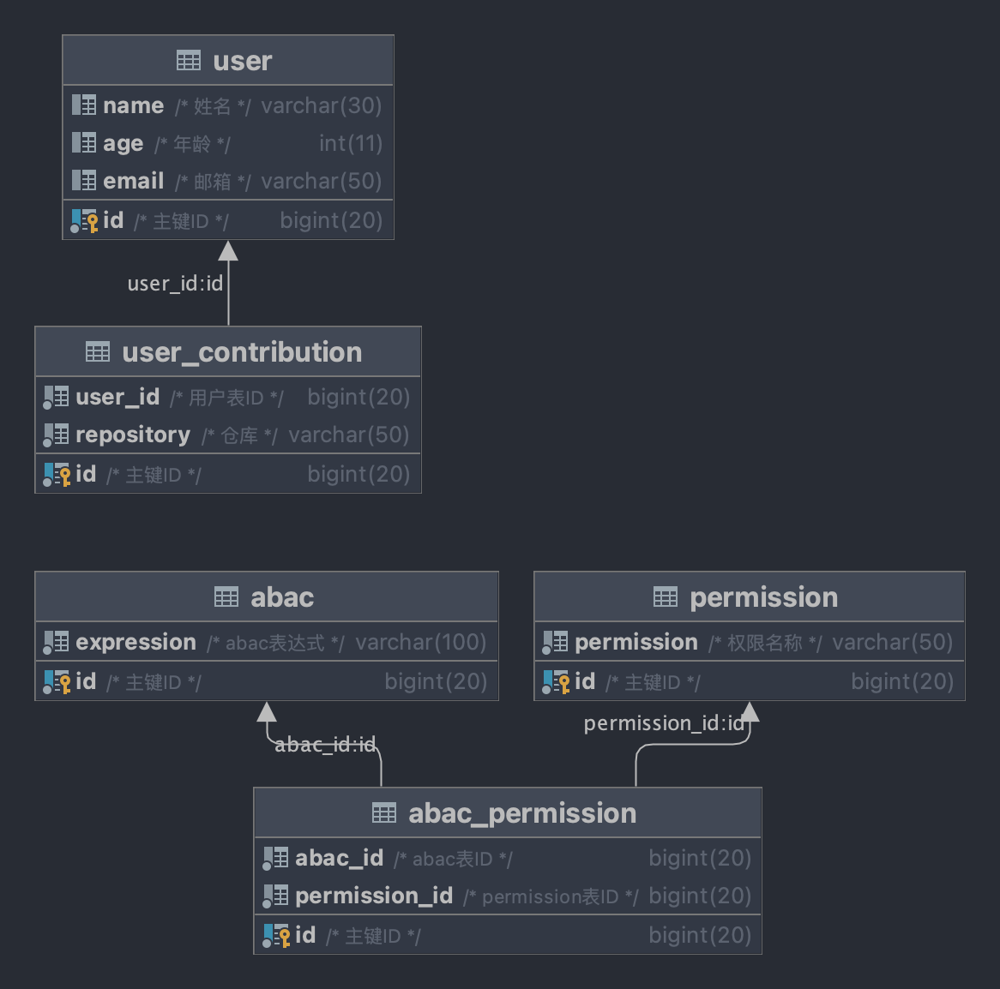

```txt
/*
 * Copyright 2021-2022 the original author or authors.
 *
 * Licensed under the Apache License, Version 2.0 (the "License");
 * you may not use this file except in compliance with the License.
 * You may obtain a copy of the License at
 *
 *     http://www.apache.org/licenses/LICENSE-2.0
 *
 * Unless required by applicable law or agreed to in writing, software
 * distributed under the License is distributed on an "AS IS" BASIS,
 * WITHOUT WARRANTIES OR CONDITIONS OF ANY KIND, either express or implied.
 * See the License for the specific language governing permissions and
 * limitations under the License.
 */
```


```txt
/**
 * @author changjin wei(魏昌进)
 * @since 2022/11/26
 */
```
<!-- TOC -->

- [ABAC授权模型](#abac授权模型)
  - [常用的授权模型](#常用的授权模型)
  - [ABAC的访问控制](#abac的访问控制)
  - [表达式语言](#表达式语言)
  - [SpEL性能](#spel性能)
- [ABAC实践](#abac实践)
  - [数据库设计](#数据库设计)
  - [java程序](#java程序)
    - [crud代码](#crud代码)
    - [security上下文](#security上下文)
  - [测试类](#测试类)
- [Spring Security 和 Apache Shiro整合](#spring-security-和-apache-shiro整合)

<!-- /TOC -->


最近有点无聊，以至于我很已经很久没有写出高质量的博客，为了挽回自己的这种无聊感打算手撕一下``ABAC模型``，毕竟``RBAC模型``五张基础表玩来玩去也玩不出来多少火花了，整理一下``ABAC``模型的实现也让这个周末更有意义一点。


第一章ABAC授权模型是为了让大家先理解何为ABAC。   
第二章ABAC实践是对ABAC模型的代码实现。   
第三章简单的描述了一下如何整合进Spring Security 或者 Apache Shiro。


项目源码：[galaxy-sea/galaxy-blogs/code/abac](https://github.com/galaxy-sea/galaxy-blogs/tree/master/code/abac)

# ABAC授权模型

- [基于属性的访问控制（ABAC）- 阿里云IDaaS](https://help.aliyun.com/document_detail/174235.html)
- [ABAC- 百度百科](https://baike.baidu.com/item/abac/3555041?fr=aladdin)

个人觉得这两篇文章已经完美描述了ABAC模型的原理


## 常用的授权模型

此节摘自[基于属性的访问控制（ABAC）- 阿里云IDaaS](https://help.aliyun.com/document_detail/174235.html)


- ACL（Access Control List），在ACL中，包含用户、资源、资源操作 三个关键要素。通过将资源以及资源操作授权给用户而使用户获取对资源进行操作的权限。

- RBAC（Role-Based Access Control ），是把用户按角色进行归类，通过用户的角色来确定用户能否针对某项资源进行某项操作。RBAC相对于ACL最大的优势就是它简化了用户与权限的管理，通过对用户进行分类，使得角色与权限关联起来，而用户与权限变成了间接关联。

- ABAC（Attribute Base Access Control） 基于属性的权限控制不同于常见的将用户通过某种方式关联到权限的方式，ABAC则是通过动态计算一个或一组属性来是否满足某种条件来进行授权判断（可以编写简单的逻辑）。属性通常来说分为四类：用户属性（如用户年龄），环境属性（如当前时间），操作属性（如读取）和对象属性，所以理论上能够实现非常灵活的权限控制，几乎能满足所有类型的需求。


## ABAC的访问控制
基于ABAC访问控制需要动态计算实体的属性、操作类型、相关的环境来控制是否有对操作对象的权限，所以在设计的时候需要考虑的条件判断的灵活性、通用性、易用性，用户只需要通过web页面即可配置授权，这需要减少硬编码似得逻辑变得简单通用，那么这需要满足一些运算符来实现。

| 类型       | 运算符                                       |
| ---------- | -------------------------------------------- |
| 算术运算符 | +, -, *, /, %, ^, div, mod                   |
| 关系运算符 | <, >, ==, !=, <=, >=, lt, gt, eq, ne, le, ge |
| 逻辑运算符 | and, or, not, &&,   \|\|, !                  |
| 条件       | ?:                                           |


> 使用场景

用户只需要配置 ``user.age > 20`` 的条件即可获得特定的权限。

## 表达式语言

正如上一节所说的需要对某种条件进行解析那么就需要表达式语言，这让我想起了``Spring Framework``的``@Value``注解和`MyBatis`的`<if test=“”>`

```java
// 相信很多 Java boy都使用过的吧
@Value("A?B:C")
private String A;
```

```java
<select id = "XXX">
    <if test="user != null">
        XXXX
    </if>
</select>
```
看到这里大家应该大致猜到了ABAC的的核心就是`Expression Language(EL)`，虽然上面的代码演示是使用Java生态作为演示，但是可以大胆的相信其他的编程语言都是有着自己的EL框架的。

java EL框架列表
- spring-expression
- OGNL
- MVEL
- JBoss EL

这里就不一一列举了感兴趣可以查看[Java EL生态排名](https://mvnrepository.com/open-source/expression-languages)

## SpEL性能

[Spring Expression Language (SpEL)官方文档](https://docs.spring.io/spring-framework/docs/current/reference/html/core.html#expressions)


```
// Spring官方文档摘取 翻译
Spring Framework 4.1 包含一个基本的表达式编译器。表达式通常被解释，这在评估期间提供了很多动态灵活性，但没有提供最佳性能。对于偶尔的表达式使用，这很好，但是，当由其他组件（如 Spring Integration）使用时，性能可能非常重要，并且没有真正需要动态性。

SpEL 编译器旨在满足这一需求。在求值期间，编译器生成一个 Java 类，它体现了运行时的表达式行为，并使用该类来实现更快的表达式求值。由于缺少表达式周围的类型，编译器在执行编译时使用在表达式的解释评估期间收集的信息。例如，它不能纯粹从表达式中知道属性引用的类型，但在第一次解释评估期间，它会找出它是什么。当然，如果各种表达式元素的类型随时间发生变化，基于此类派生信息进行编译可能会在以后造成麻烦。出于这个原因，编译最适合其类型信息在重复计算时不会改变的表达式。

考虑以下基本表达式：

someArray[0].someProperty.someOtherProperty < 0.1

由于前面的表达式涉及数组访问、某些属性取消引用和数字操作，因此性能提升非常显着。在一个运行 50000 次迭代的微型基准测试示例中，使用解释器评估需要 75 毫秒，使用表达式的编译版本仅需要 3 毫秒。
```

有关SpEL的性能Spring官方描述说SpEL的性能很棒（个人感觉Spring对自己的测试结果是不是少打了一个0啊，3ms的时间有点无法理解）


# ABAC实践

本章仅实现ABAC的原理，不会对Spring Security和 Apache Shiro做任何的集成


因为笔者本人是一位Spring boy，所以工程项目会以Spring Boot框架作为基础，使用其它编程语言的同学可能需要受苦一下了😂, 大家看懂原理就可以了。


- Java 8
- Spring Boot 2.7.6
- MyBatis Plus 3.5.2
- MySQL 8.0

## 数据库设计



| 表名                | 作用                           |
|-------------------|------------------------------|
| user              | 用户表(ACL和RBAC都有这张表)           |
| user_contribution | 用户的附属信息 (用户属性之类的,不能不一定只有这张表) |
| permission        | 权限表达式(ACL和RBAC都有这张表)         |
| abac              | rbac表达式                      |
| abac_permission   | rbac表达式和权限的绑定关系, o2m         |


```sql
# 用户表
DROP TABLE if EXISTS user;
CREATE TABLE user (
    id bigint(20) NOT NULL COMMENT '主键ID',
    name varchar(30) NULL DEFAULT NULL COMMENT '姓名',
    age int(11) NULL DEFAULT NULL COMMENT '年龄',
    email varchar(50) NULL DEFAULT NULL COMMENT '邮箱',
    PRIMARY KEY (id)
);
# 用户边缘数据
DROP TABLE if EXISTS user_contribution;
CREATE TABLE user_contribution (
    id bigint(20) NOT NULL COMMENT '主键ID',
    user_id bigint(20)  NOT NULL COMMENT '用户表ID',
    repository varchar(100) NOT NULL COMMENT '仓库',
    PRIMARY KEY (id)
);
# 权限表
DROP TABLE if EXISTS permission;
CREATE TABLE permission (
    id bigint(20) NOT NULL COMMENT '主键ID',
    permission varchar(100) NOT NULL COMMENT '权限名称',
    PRIMARY KEY (id)
);
# abac表达式表
DROP TABLE if EXISTS abac;
CREATE TABLE abac (
    id bigint(20) NOT NULL COMMENT '主键ID',
    expression varchar(100) NOT NULL COMMENT 'abac表达式',
    PRIMARY KEY (id)
);
# abac表和权限表的关联表, o2m
DROP TABLE if EXISTS abac_permission;
CREATE TABLE abac_permission (
    id bigint(20) NOT NULL COMMENT '主键ID',
    abac_id bigint(20) NOT NULL COMMENT 'abac表ID',
    permission_id bigint(20) NOT NULL COMMENT 'permission表ID',
    PRIMARY KEY (id)
);

```

## java程序

因为篇幅问题， 只会使用必要的代码，
代码文件结构
```txt
 |src
 | |test
 | | |java
 | | | |plus.wcj.abac.AbacApplicationTests.java  测试类代码
 | |main
 | | |resources
 | | | |application.yml
 | | | |db
 | | | | |schema-h2.sql // DDL
 | | | | |data-h2.sql // DML
 | | |java
 | | | |plus.wcj.abac
 | | | | | | |AbacApplication.java // Spring Boot启动类
 | | | | | | |security
 | | | | | | | |MetadataCustomizer.java // 自定义user信息
 | | | | | | | |SecurityContext.java  // Security上下文
 | | | | | | |entity
 | | | | | | | |Abac.java
 | | | | | | | |User.java
 | | | | | | |dao
 | | | | | | | |UserDao.java
 | | | | | | | |AbacDao.java
 | | | | | | |service
 | | | | | | | |UserService.java
 | | | | | | | |AbacService.java
 |pom.xml
```


### crud代码


> pom.xml
```xml
    <dependencies>
        <dependency>
            <groupId>org.springframework.boot</groupId>
            <artifactId>spring-boot-starter</artifactId>
        </dependency>

        <dependency>
            <groupId>org.springframework.boot</groupId>
            <artifactId>spring-boot-starter-test</artifactId>
            <scope>test</scope>
        </dependency>

        <dependency>
            <groupId>com.baomidou</groupId>
            <artifactId>mybatis-plus-boot-starter</artifactId>
            <version>3.5.2</version>
        </dependency>

        <dependency>
            <groupId>mysql</groupId>
            <artifactId>mysql-connector-java</artifactId>
        </dependency>

        <dependency>
            <groupId>org.projectlombok</groupId>
            <artifactId>lombok</artifactId>
            <scope>compile</scope>
        </dependency>
    </dependencies>
```

> entity类

```java
/**
 * @author changjin wei(魏昌进)
 * @since 2022/11/26
 */
@Data
public class Abac {
    private Long id;
    private String expression;

    /** expression对应的permissions列表 */
    @TableField(exist = false)
    private List<String> permissions;
}

@Data
public class User {
    private Long id;
    private String name;
    private Integer age;
    private String email;

    /** 用户提交过仓库 */
    @TableField(exist = false)
    private List<String> contributions = new ArrayList<>();

    /** 存放一些乱七八糟的数据，当然contributions字段也放在这里 */
    @TableField(exist = false)
    private Map<String, Object> metadata = new HashMap<>();
}
```


> dao类

```java
/**
 * @author changjin wei(魏昌进)
 * @since 2022/11/26
 */
@Mapper
public interface AbacDao extends BaseMapper<Abac> {

    /** 获取abacId关联权限 */
    @Select("SELECT p.permission\n" +
            "FROM abac_permission ap LEFT JOIN permission p ON p.id = ap.permission_id\n" +
            "WHERE ap.abac_id = #{abacId}")
    List<String> selectPermissions(Long abacId);

}

/**
 * @author changjin wei(魏昌进)
 * @since 2022/11/26
 */
@Mapper
public interface UserDao extends BaseMapper<User> {

    /** 获取用户的仓库信息 */
    @Select("SELECT repository FROM user_contribution WHERE user_id = #{userId}")
    List<String> selectRepository(@Param("userId") Long userId);
}

```

> service类

```java
/**
 * @author changjin wei(魏昌进)
 * @since 2022/11/26
 */
@Service
@RequiredArgsConstructor
public class AbacService {
    private final AbacDao abacDao;

    /** 获取abac表达式详细信息列表 */
    public List<Abac> getAll() {
        List<Abac> abacs = abacDao.selectList(null);
        for (Abac abac : abacs) {
            List<String> permissions = abacDao.selectPermissions(abac.getId());
            abac.setPermissions(permissions);
        }
        return abacs;
    }
}


/**
 * @author changjin wei(魏昌进)
 * @since 2022/11/26
 */
@Service
@RequiredArgsConstructor
public class UserService {
    private final UserDao userDao;

    /** 根据userId获取用户详细信息 */
    public User get(Long userId) {
        User user = userDao.selectById(userId);
        List<String> repository = userDao.selectRepository(userId);
        user.setContributions(repository);
        return user;
    }
}
```

### security上下文

```java

/**
 * 自定义用户元数据  用于获取一些实体的属性、操作类型、相关的环境
 *
 * @author changjin wei(魏昌进)
 * @since 2022/11/26
 */
public interface MetadataCustomizer {

    /** 自定义用户元数据 */
    void customize(User user);
}


/**
 * 解析abac表达式
 *
 * @author changjin wei(魏昌进)
 * @since 2022/11/26
 */
@Component
public class SecurityContext {
    /** SpEL表达式解析器 */
    private final ExpressionParser expressionParser = new SpelExpressionParser();

    /**
     *  解析abac表达式
     * @param user 用户详细信息
     * @param abacs abac表达式详细信息集合
     * @return expressions集合, 将这个结果集存放到 Spring Security 或者Apache APISIX的userDetail上下文中
     */
    public List<String> rbacPermissions(User user, List<Abac> abacs) {
        return this.rbacPermissions(user, abacs, Collections.emptyList());
    }

    /**
     * 解析abac表达式
     * @param user 用户详细信息
     * @param abacs abac表达式详细信息集合
     * @param metadataCustomizers  自定义用户元数据  用于获取一些实体的属性、操作类型、相关的环境
     * @return expressions集合, 将这个结果集存放到 Spring Security 或者Apache APISIX的userDetail上下文中
     */
    public List<String> rbacPermissions(User user, List<Abac> abacs, List<MetadataCustomizer> metadataCustomizers) {
        // 处理自定义元数据
        metadataCustomizers.forEach(metadataCustomizer -> metadataCustomizer.customize(user));

        List<String> expressions = new ArrayList<>();
        for (Abac abac : abacs) {
            // 解析表达式的求值器
            Expression expression = expressionParser.parseExpression(abac.getExpression());
            // 创建环境上下文
            EvaluationContext context = new StandardEvaluationContext(user);
            // 获取expression的结果
            if (expression.getValue(context, boolean.class)) {
                expressions.addAll(abac.getPermissions());
            }
        }
        return expressions;
    }

}

```


## 测试类


```java

/**
 * @author changjin wei(魏昌进)
 * @since 2022/11/26
 */
@SpringBootTest
class AbacApplicationTests {

    @Autowired
    private UserService userService;

    @Autowired
    private AbacService abacService;

    @Autowired
    private SecurityContext securityContext;

    /** 获取不同用户的abac权限 */
    @Test
    void testRbac() {
        User user = userService.get(1L);
        List<Abac> rbac = abacService.getAll();
        List<String> permissions = securityContext.rbacPermissions(user, rbac);
        System.out.println(permissions);


        user = userService.get(2L);
        permissions = securityContext.rbacPermissions(user, rbac);
        System.out.println(permissions);

        user = userService.get(3L);
        permissions = securityContext.rbacPermissions(user, rbac);
        System.out.println(permissions);


    }

    /**
     * 获取自定义权限
     */
    @Test
    void testMetadataCustomizer() {
        User user = userService.get(1L);
        List<Abac> rbac = abacService.getAll();

        List<String> permissions = securityContext.rbacPermissions(user, rbac);
        System.out.println(permissions);

        permissions = securityContext.rbacPermissions(user, rbac, getMetadataCustomizer());
        System.out.println(permissions);
    }

    /** 模拟网络ip */
    private List<MetadataCustomizer> getMetadataCustomizer() {
        return new ArrayList<MetadataCustomizer>() {{
            add(user -> user.getMetadata().put("ip", "192.168.0.1"));
        }};
    }
}

```

```sql
DELETE FROM user;
INSERT INTO user (id, name, age, email)
VALUES (1, '魏昌进', 26, 'mail@wcj.plus'),
       (2, 'test', 1, 'mail1@wcj.plus'),
       (3, 'admin', 1, 'mail2@wcj.plus');

DELETE FROM user_contribution;
INSERT INTO user_contribution (id, user_id, repository)
VALUES (1, 1, 'galaxy-sea/spring-cloud-apisix'),
       (2, 2, 'spring-cloud/spring-cloud-commons'),
       (3, 2, 'spring-cloud/spring-cloud-openfeign'),
       (4, 2, 'alibaba/spring-cloud-alibaba'),
       (5, 2, 'Tencent/spring-cloud-tencent'),
       (6, 2, 'apache/apisix-docker');

DELETE FROM permission;
INSERT INTO permission (id, permission)
VALUES (1, 'github:pr:merge'),
       (2, 'github:pr:close'),
       (3, 'github:pr:open'),
       (4, 'github:pr:comment');


DELETE FROM abac;
INSERT INTO abac (id, expression)
VALUES (1, 'contributions.contains(''galaxy-sea/spring-cloud-apisix'')'),
       (2, 'name == ''admin'''),
       (3, 'metadata.get(''ip'') == ''192.168.0.1''');

DELETE FROM abac_permission;
INSERT INTO abac_permission (id, abac_id, permission_id)
VALUES (1, 1, 1),

       (2, 2, 1),
       (3, 2, 2),
       (4, 2, 3),
       (5, 2, 4),

       (6, 3, 1),
       (7, 3, 2),
       (8, 3, 3),
       (9, 3, 4);
```


# Spring Security 和 Apache Shiro整合
Spring Security只需要修改拦截器即可在获取到``UserDetails``将``SecurityContext#rbacPermissions``转换为``GrantedAuthority``即可

```java
/**
 * 这里是伪代码， 展示一下大概逻辑
 *
 * @author changjin wei(魏昌进)
 * @since 2022/04/29
 */
public class IamOncePerRequestFilter implements OncePerRequestFilter {

  @Autowired
  private SecurityContext securityContext;

  @Autowired
  private AbacService abacService;

  @Autowired
  private List<MetadataCustomizer> metadataCustomizers;

  @Autowired
  public void doFilterInternal(HttpServletRequest request, HttpServletResponse response, FilterChain filterChain) {
    UserDetails user = toUser();
    List<String> permissions = securityContext.rbacPermissions(user, abacService.getAll(), metadataCustomizers);
    List<GrantedAuthority> abacAuthority = permissions.stream().map(SimpleGrantedAuthority::new).collect(Collectors.toList());
    user.getAuthorities().addAll(abacAuthority);
  }
}

```