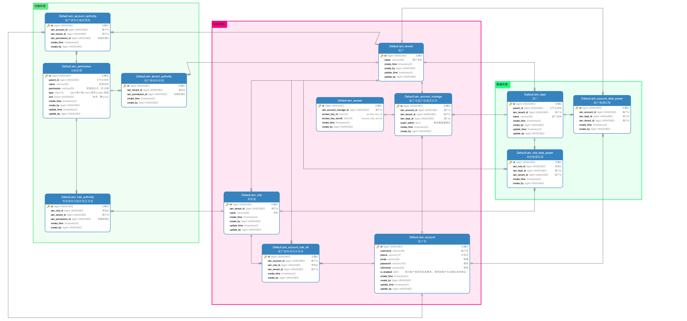
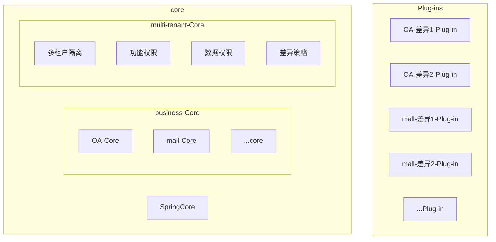

```
/*
 * Copyright 2022 the original author or authors.
 *
 * Licensed under the Apache License, Version 2.0 (the "License");
 * you may not use this file except in compliance with the License.
 * You may obtain a copy of the License at
 *
 *     http://www.apache.org/licenses/LICENSE-2.0
 *
 * Unless required by applicable law or agreed to in writing, software
 * distributed under the License is distributed on an "AS IS" BASIS,
 * WITHOUT WARRANTIES OR CONDITIONS OF ANY KIND, either express or implied.
 * See the License for the specific language governing permissions and
 * limitations under the License.
 */
```

```
/**
 * @author changjin wei(魏昌进)
 * @since 2022/6/5
 */
```

<!-- TOC -->

- [1. 向SaaS致敬](#1-向saas致敬)
- [2. 租户设计](#2-租户设计)
  - [2.1. 租户](#21-租户)
  - [2.2. 账户](#22-账户)
  - [2.3. 角色](#23-角色)
- [3. 权限](#3-权限)
  - [3.1. 功能权限](#31-功能权限)
  - [3.2. 数据权限](#32-数据权限)
  - [3.3. 子租户问题](#33-子租户问题)
  - [iam_dept的ID问题](#iam_dept的id问题)
- [SaaS平台需求差异化问题](#saas平台需求差异化问题)
  - [Controller层使用RequestCondition设计](#controller层使用requestcondition设计)
  - [Service层使用策略模式设计](#service层使用策略模式设计)
  - [围绕着配置设计差异化](#围绕着配置设计差异化)
  - [围绕着权限设计差异化](#围绕着权限设计差异化)
  - [卖软件的](#卖软件的)
  - [做平台卖服务的](#做平台卖服务的)
  - [大到业务逻辑也完全不一致的](#大到业务逻辑也完全不一致的)

<!-- /TOC -->


# 1. 向SaaS致敬
距离10月还剩下4个月了，在最后的计算机生涯留下一些有用的东西吧。人生最不应该的事情就是拿兴趣爱好来挣钱。

``SaaS电商``是我从事计算机领域第一次开发的项目，几位师傅带我玩代码。我也即将离开浮躁的计算机软件开发行业了，虽然还不知未来会从事的行业但是还是很幸运能和几位师傅和很多小伙伴一起玩代码的时光滴。

下面就介绍一下``SaaS``的设计和实现吧，因为保密协议的问题很多东西不能明着写，大家有实力的人看到demo就应该明白我的思想了




# 2. 租户设计


1. 组织架构相关
   1. iam_tenant
   2. iam_account
      2. iam_account_manage
      3. iam_access  
   3. iam_role
      1. iam_account_role_rel
2. 功能权限相关
   1. iam_permission
      1. iam_tenant_authority
      2. iam_role_authority
      3. iam_account_authority
3. 数据权限相关
   1. iam_dept
      1. iam_account_data_power
      2. iam_role_data_power


## 2.1. 租户

这一章百度上面有很多的文章介绍的，只说一下我的想法就好了，不过多的赘述了。

租户隔离界别一共4种。
1. database
2. schema
3. table
4. field

4种隔离界别从下向上兼容，为了满足私有化部署，请直接选择``field``作为隔离界别，这样子可以满足租户想要从公共部署环境迁移到私有部署环境的要求和私有环境迁移到公共环境部署的要求，这样子做的好处就是可以让编程模型统一。

iam_tenant：租户表


## 2.2. 账户
思考一下账户为啥设计3张表呐（起初就1张表的啦），当然是为了账户独立出来做胯租户系统，账户不与租户进行绑定从而实现胯租户的需求

iam_account：是作为账户表，
iam_account_manage：作为账户和租户的绑定表，
iam_access：作为open API的 access信息，


## 2.3. 角色
单纯为了帮助rbac模型的，没有多大营养价值。


# 3. 权限

``权限``我个人喜欢称之为``资源（resource）``，权限、数据、API、应用、菜单、按钮、js文件、HTML文件、CSS文件、图片、等等等都可以称之为``资源``，之所以要这样子做是因为SaaS模型就是你拥有这些资源你就可以访问。

常用的授权模型主要有 3 种：

|      |                    |
| ---- | ------------------ |
| ACL  | 访问控制列表       |
| RBAC | 基于角色的权限控制 |
| ABAC | 基于属性的权限控制 |

那么权限这里rbac+ACL即可满足大部分的业务场景了，ABAC赋予一些骚操作。


## 3.1. 功能权限

如果说SaaS是开通服务及授权``功能``，那么相应的``功能``就需要抽象成为一种``资源``。

iam_permission：对应系统中需要硬编码的权限表达式
iam_tenant_authority：租户拥有什么权限，主要是SaaS平台租户购买的功能就赋予租户相应的权限，数据来源于iam_permission
iam_role_authority：rbac模型，数据来源于iam_tenant_authority
iam_account_authority：ACL模型，数据来源于iam_tenant_authority

通过``iam_tenant_authority``、``iam_role_authority``、``iam_account_authority``三张表围绕着``iam_permission``,来进行设计。

租户购买了相应的功能则分配权限给``iam_tenant_authority``, 满足SaaS系统的按需购买权限，通过``iam_tenant_authority``来分配RBAC和ACL权限。

``iam_account_manage``中有个``super_admin``字段就是为了给ABAC进行一些骚操作的。``super_admin``默认为true的情况下默认返回当前租户的``iam_tenant_authority``中所有的功能权限。


## 3.2. 数据权限

这里的数据权限完全就是为了满足OA、mes、erp等等设计的，这里的数据权限设计也延续了功能权限的设计。

iam_dept：部门，
iam_role_data_power：rbac模型角色的数据权限
iam_account_data_power：ACL模型账户的数据权限，

因为租户之间的数据是完全隔离的，所以在数据权限这里会比功能权限少一张表。

``iam_account_manage``中的``super_admin``返回当前租户下所有的``iam_dept``数据，


## 3.3. 子租户问题

子租户问题经常会在SaaS系统遇到，电商的多商铺经营、物业系统多个小区管理、等等很多场景都会遇到子租户的问题。虽然``iam_account_manage``的设计的时候是可以夸租户但是租户的数据本是要做安全隔离不可随意数据跨越。

其实子租户利用``iam_dept``进行子租户的设计即可，所以数据权限来实现子租户的是完全没有问题的。

## iam_dept的ID问题

这个问题就很操蛋了，因为数据权限的sql要么用in或者EXISTS但是数据量上来的时候这两个查询方式对索引就不是很友好了，所以有时候一个ID的设计也是很有一门学问吧，id自增长和雪花算法等等在租户的数据随意插入后 mysql的索引就出现了问题（查询方面），那就需要骚操作了。

不使用in和EXISTS来进行条件的过滤，而是使用between来进行数据的筛选，所以设计的时候就需要对iam_dept进行有规则的增长，那么``iam_tenant_id+00001～99999``的区间方式就很适合作为对索引进行一个优化使用了，通过提前设计让iam_dept在page中形成连续的数据，以增加在查询方面效率（操作很骚，来一发何妨呢）


# SaaS平台需求差异化问题

因为不同的架构师对需求差异化的处理都不同，没有必要比拼谁的方式更优秀。


业务开发的时候经常会遇到客户的需求差异化问题，这个问题在我刚出道的时候的确是很难解决，出道多年之后也是很难去解决的。有时候差异化只是一个小小的if分子，有时候大到整个业务逻辑都不一致，确实多年的经验告诉我对接客户的时候任何妖魔鬼怪都是会各显神通的。


因为我个人喜欢``微内核(core)``+``插件化(Plug-in)``架构进行开发，因为依托于``Spring core``可以很好的进行插件化开发，通过maven的profile条件编译和spring的@Conditional条件装配 操作性就上来了。



差异化可大可小，所以要设计一个好的差异策略是一件比较难的事情。

1. 基于权限进行设计
   - 围绕着Controller层进行设计
   - 围绕着Service层进行设计
2. 


## Controller层使用RequestCondition设计

Controller层


## Service层使用策略模式设计


差异策略的实现有很多方式了，还是围绕着功能权限设计会比较好一点。就像上文说权限也是一种资源那么 差异化也可以抽象成为一种资源的话那么围绕着不同的需求差异做不同的权限不是更合理嘛。

## 围绕着配置设计差异化
工作流设计通用的业务，


## 围绕着权限设计差异化


在xx-core能满足业务只是在小部分if存在差异化的情况下
- controller差异化
  - 策略设计模式
  - RequestCondition设计权重
- service差异化
  - 策略设计模式
- dao差异化
  - 策略设计模式
  - rdbms+json字段 


## 卖软件的

 OA，ERP，这一些只是单纯的卖软件挣维护费的，基本上都是私有部署的话简单的模块化部署既可以了。

``maven多模块``+``maven的profiles条件编译``+``Spring的Conditional条件装配``基本上就能解决需求差异化，基本上呐就帮助了不同不可客户打包不同的版本的软件了，

- core
  - Mall-core
  - OA-core
- 客户1的模块
  - 客户1的Mall-core差异化需求
- 客户2的模块
  - 客户2的OA-core差异化需求

```
    <profiles>
        <profile>
            <id>客户1</id>
            <dependencies>
                <dependency>
                    <groupId>plus.wcj</groupId>
                    <artifactId>客户1的Mall-core</artifactId>
                </dependency>
            </dependencies>
        </profile>

        <profile>
            <id>客户2</id>
            <dependencies>
                <dependency>
                    <groupId>plus.wcj</groupId>
                    <artifactId>客户2的OA-core</artifactId>
                </dependency>
            </dependencies>
        </profile>
    </profiles>
    
    <dependencies>
        <dependency>
            <groupId>plus.wcj</groupId>
            <artifactId>core</artifactId>
        </dependency>
        <dependency>
            <groupId>plus.wcj</groupId>
            <artifactId>Mall-core</artifactId>
        </dependency>
        <dependency>
            <groupId>plus.wcj</groupId>
            <artifactId>OA-core</artifactId>
        </dependency>
    </dependencies>
```

## 做平台卖服务的

有赞、微盟、凡科这些卖服务的平台，因为提供一套完整的平台给客户使用但是针对大客户也是会存在不同的差异需求。

``maven多模块``+``策略设计模式`` 这种模式可以根据不同的租户进行一个实现类的隔离，但是其具体的架构设计很考验架构师的掌控力，


## 大到业务逻辑也完全不一致的


